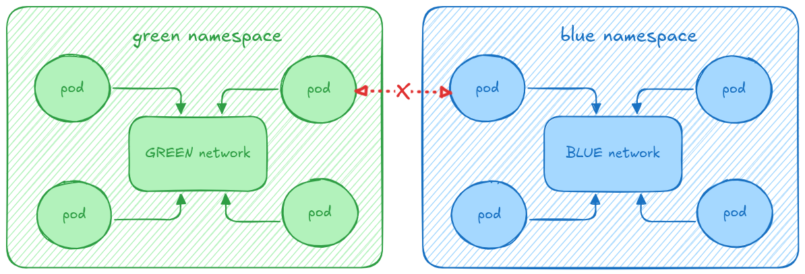

# fosdem-2025-p-udn
Demo scripts / config for the "Free my Kubernetes network! Breaking away from
the Kubernetes networking model" talk at FOSDEM 2025

## Requirements
- git
- jq
- kind
- OVN-Kubernetes CNI
- docker (metalLB tooling currently hardcodes docker as container runtime)
- Multus-cni
- KubeVirt
- virtctl
- kubectl

## Setup demo environment
Refer to the OVN-Kubernetes repo KIND documentation for more details; the gist
of it is you should clone the OVN-Kubernetes repository, and run their kind
helper script:

```
git clone git@github.com:ovn-org/ovn-kubernetes.git

cd ovn-kubernetes
pushd contrib ; ./kind.sh --multi-network-enable -ic -nse -mlb -ikv; popd
```

This will get you a running kind cluster (one control plane, and two worker
nodes) in interconnect mode, configured to use OVN-Kubernetes as the default
cluster network, configuring the `multi-homing`, `network-segmentation` feature
gates, and finally, deploying `multus-cni`, `KubeVirt`, and `metalLB` in the
cluster. It also deploys a container connected to the docker network, which will
be used as the client to ingress into the cluster.

With this, we have *everything* we need to proceed with the demo.

## Namespace isolation use-case
In the diagram below, you will find the graphical depiction of the use case we
are trying to achieve:


We want to create multiple namespaces, and two workloads in each of these.
We then want to show that inter-namespace communication is feasible, while
accessing other namespaces is not allowed. And all that without writing a single
network policy.

For now, let's focus on getting our `green` namespace configured. Please
provision the following manifests to setup this scenario:
- [Primary UDN configuration](manifests/ns-isolation/01-namespace-isolation-l2-persistent.yaml)
- [Workloads](manifests/ns-isolation/02-namespace-isolation-workloads.yaml)

Once you do, you'll now have a namespace - named `green` - with a layer2
primary UDN in it. The east / west communication (i.e. how your workloads
communicate within the network) is performed over the created overlay, using
GENEVE tunnels.

You will also have 2 VMs attached to the network, alongside a pod.

We will now check the following things:
- east / west traffic (between a VM and a pod)
- egress from one VM to the world wide web
- TCP connections are **not** interrupted during VM live-migration

Let's start with the first !

### East / west traffic
We have already created the `green` namespace, and its workloads: a pod, and two
VMs.

The pod is running a web server on port 9000; let's log into one of our VMs, and
reach over to the web server, hosted on the pod:

```
# let's get the webserver pod IP address
kubectl get pods -ngreen webserver -ojsonpath="{@.metadata.annotations.k8s\.v1\.cni\.cncf\.io\/network-status}" | jq
[
  {
    "name": "ovn-kubernetes",
    "interface": "eth0",
    "ips": [
      "10.244.1.10"
    ],
    "mac": "0a:58:0a:f4:01:0a",
    "dns": {}
  },
  {
    "name": "ovn-kubernetes",
    "interface": "ovn-udn1",
    "ips": [
      "203.203.0.4"
    ],
    "mac": "0a:58:cb:cb:00:04",
    "default": true,
    "dns": {}
  }
]

# login using fedora/fedora
virtctl console -ngreen vm-a
Successfully connected to vm-a console. The escape sequence is ^]

vm-a login: fedora
Password:
[fedora@vm-a ~]$ curl 203.203.0.4:9000/hostname
webserver # reply from the webserver
```

This shows east/west traffic over a layer2 primary user defined network.

## VM egress
Let's assume we're still logged into via console to the `vm-a` in the`green`
namespace. We will now reach outside the cluster, and show egress works over the
UDN network.

```
# login using fedora/fedora
virtctl console -ngreen vm-a
Successfully connected to vm-a console. The escape sequence is ^]

vm-a login: fedora
Password:
# let's first show the VM's IPs and routes ...
[fedora@vm-a ~]$ ip a
1: lo: <LOOPBACK,UP,LOWER_UP> mtu 65536 qdisc noqueue state UNKNOWN group default qlen 1000
    link/loopback 00:00:00:00:00:00 brd 00:00:00:00:00:00
    inet 127.0.0.1/8 scope host lo
       valid_lft forever preferred_lft forever
    inet6 ::1/128 scope host
       valid_lft forever preferred_lft forever
2: eth0: <BROADCAST,MULTICAST,UP,LOWER_UP> mtu 1400 qdisc fq_codel state UP group default qlen 1000
    link/ether 0a:58:cb:cb:00:05 brd ff:ff:ff:ff:ff:ff
    altname enp1s0
    inet 203.203.0.5/16 brd 203.203.255.255 scope global dynamic noprefixroute eth0
       valid_lft 2786sec preferred_lft 2786sec
    inet6 fe80::858:cbff:fecb:5/64 scope link
       valid_lft forever preferred_lft forever

[fedora@vm-a ~]$ ip r
default via 203.203.0.1 dev eth0 proto dhcp metric 100
203.203.0.0/16 dev eth0 proto kernel scope link src 203.203.0.5 metric 100

[fedora@vm-a ~]$ ping -c 2 www.google.com
PING www.google.com (142.250.200.100) 56(84) bytes of data.
64 bytes from 142.250.200.100 (142.250.200.100): icmp_seq=1 ttl=115 time=7.15 ms
64 bytes from 142.250.200.100 (142.250.200.100): icmp_seq=2 ttl=115 time=6.55 ms

--- www.google.com ping statistics ---
2 packets transmitted, 2 received, 0% packet loss, time 1002ms
rtt min/avg/max/mdev = 6.548/6.849/7.150/0.301 ms
```

This proves we can egress the cluster over the primary UDN network.

## TCP connections survive live-migration
For this demo, we will create an iperf session between our two VMs, then migrate
the server. If the TCP connection breaks, the client will be reset. Worry not!
That won't happen.

For that, we need to first figure out the IPs of our VMs:
```
kubectl get -ngreen vmi -owide
NAME   AGE   PHASE     IP            NODENAME      READY   LIVE-MIGRATABLE   PAUSED
vm-a   20m   Running   203.203.0.5   ovn-worker2   True    True
vm-b   20m   Running   203.203.0.6   ovn-worker    True    True

# let's start the iperf server in `vm-b` (for instance)
# password is also fedora/fedora
virtctl console -ngreen vm-b
Successfully connected to vm-b console. The escape sequence is ^]

vm-b login: fedora
Password:
[fedora@vm-b ~]$ iperf3 -s -p 9500 -1
-----------------------------------------------------------
Server listening on 9500 (test #1)
-----------------------------------------------------------
```

The above command starts a TCP server listening on port 9500, which will accept
a **single** TCP connection. If it somehow breaks, no other connections will be
accepted.

Let's now handle the client:
```
virtctl console -ngreen vm-a
Successfully connected to vm-a console. The escape sequence is ^]

# keep in mind the iperf server is located at 203.203.0.6, port 9500 ...
[fedora@vm-a ~]$ iperf3 -c 203.203.0.6 -p9500 -t3600
Connecting to host 203.203.0.6, port 9500
[  5] local 203.203.0.5 port 56618 connected to 203.203.0.6 port 9500
[ ID] Interval           Transfer     Bitrate         Retr  Cwnd
[  5]   0.00-1.00   sec  2.59 GBytes  22.2 Gbits/sec    0   2.30 MBytes
[  5]   1.00-2.00   sec  2.53 GBytes  21.7 Gbits/sec    0   2.78 MBytes
[  5]   2.00-3.00   sec  2.95 GBytes  25.3 Gbits/sec    0   3.04 MBytes
[  5]   3.00-4.00   sec  3.93 GBytes  33.7 Gbits/sec    0   3.04 MBytes
[  5]   4.00-5.00   sec  3.83 GBytes  32.9 Gbits/sec    0   3.04 MBytes
[  5]   5.00-6.00   sec  3.99 GBytes  34.3 Gbits/sec    0   3.04 MBytes
[  5]   6.00-7.00   sec  3.89 GBytes  33.4 Gbits/sec    0   3.04 MBytes
[  5]   7.00-8.00   sec  3.88 GBytes  33.3 Gbits/sec    0   3.04 MBytes
[  5]   8.00-9.00   sec  3.94 GBytes  33.8 Gbits/sec    0   3.04 MBytes
[  5]   9.00-10.00  sec  3.80 GBytes  32.7 Gbits/sec    0   3.04 MBytes
[  5]  10.00-11.00  sec  3.98 GBytes  34.2 Gbits/sec    0   3.04 MBytes
[  5]  11.00-12.00  sec  3.67 GBytes  31.5 Gbits/sec    0   3.04 MBytes
[  5]  12.00-13.00  sec  3.87 GBytes  33.3 Gbits/sec    0   3.04 MBytes
[  5]  13.00-14.00  sec  3.82 GBytes  32.8 Gbits/sec    0   3.04 MBytes
[  5]  14.00-15.00  sec  3.80 GBytes  32.6 Gbits/sec    0   3.04 MBytes
...
```

Let's now migrate the server VM to another node! Use the following virtctl
command:
```
virtctl migrate -ngreen vm-b
VM vm-b was scheduled to migrate

kubectl get pods -ngreen -w
NAME                       READY   STATUS            RESTARTS   AGE
virt-launcher-vm-a-r44bp   2/2     Running           0          22m
virt-launcher-vm-b-44vs4   2/2     Running           0          22m
virt-launcher-vm-b-wct76   0/2     PodInitializing   0          8s
webserver                  1/1     Running           0          22m
virt-launcher-vm-b-wct76   2/2     Running           0          13s
virt-launcher-vm-b-wct76   2/2     Running           0          16s
virt-launcher-vm-b-wct76   2/2     Running           0          16s
virt-launcher-vm-b-wct76   2/2     Running           0          16s
virt-launcher-vm-b-wct76   2/2     Running           0          17s
virt-launcher-vm-b-44vs4   1/2     NotReady          0          22m
virt-launcher-vm-b-44vs4   0/2     Completed         0          23m
virt-launcher-vm-b-44vs4   0/2     Completed         0          23m

# and this is what the client sees when the migration occurs:
...
[  5]  40.00-41.00  sec  2.79 GBytes  23.9 Gbits/sec    0   3.04 MBytes
[  5]  41.00-42.00  sec  2.53 GBytes  21.7 Gbits/sec    0   3.04 MBytes
[  5]  42.00-43.00  sec  2.57 GBytes  22.1 Gbits/sec    0   3.04 MBytes
[  5]  43.00-44.00  sec  2.67 GBytes  22.9 Gbits/sec    0   3.04 MBytes
[  5]  44.00-45.00  sec  2.94 GBytes  25.2 Gbits/sec    0   3.04 MBytes
[  5]  45.00-46.00  sec  3.16 GBytes  27.1 Gbits/sec    0   3.04 MBytes
[  5]  46.00-47.00  sec  3.33 GBytes  28.6 Gbits/sec    0   3.04 MBytes
[  5]  47.00-48.00  sec  3.11 GBytes  26.7 Gbits/sec    0   3.04 MBytes
[  5]  48.00-49.00  sec  2.62 GBytes  22.5 Gbits/sec    0   3.04 MBytes
[  5]  49.00-50.00  sec  2.77 GBytes  23.8 Gbits/sec    0   3.04 MBytes
[  5]  50.00-51.00  sec  2.79 GBytes  23.9 Gbits/sec    0   3.04 MBytes
[  5]  51.00-52.00  sec  2.19 GBytes  18.8 Gbits/sec    0   3.04 MBytes
[  5]  52.00-53.00  sec  3.29 GBytes  28.3 Gbits/sec  2229   2.30 MBytes
[  5]  53.00-54.00  sec  3.80 GBytes  32.6 Gbits/sec    0   2.43 MBytes
[  5]  54.00-55.00  sec  5.08 GBytes  43.6 Gbits/sec    0   2.60 MBytes
[  5]  55.00-56.00  sec  5.18 GBytes  44.5 Gbits/sec    0   2.62 MBytes
[  5]  56.00-57.00  sec  5.35 GBytes  46.0 Gbits/sec    0   2.74 MBytes
[  5]  57.00-58.00  sec  5.14 GBytes  44.2 Gbits/sec    0   2.89 MBytes
[  5]  58.00-59.00  sec  5.28 GBytes  45.4 Gbits/sec    0   2.93 MBytes
[  5]  59.00-60.00  sec  5.22 GBytes  44.9 Gbits/sec    0   2.97 MBytes
[  5]  60.00-61.00  sec  4.97 GBytes  42.7 Gbits/sec    0   2.99 MBytes
[  5]  61.00-62.00  sec  4.78 GBytes  41.1 Gbits/sec    0   3.02 MBytes
[  5]  62.00-63.00  sec  5.14 GBytes  44.1 Gbits/sec    0   3.02 MBytes
[  5]  63.00-64.00  sec  5.06 GBytes  43.5 Gbits/sec    0   3.02 MBytes
[  5]  64.00-65.00  sec  5.02 GBytes  43.1 Gbits/sec    0   3.02 MBytes
[  5]  65.00-66.00  sec  5.07 GBytes  43.5 Gbits/sec    0   3.02 MBytes
[  5]  66.00-67.00  sec  5.34 GBytes  45.9 Gbits/sec    0   3.02 MBytes
[  5]  67.00-68.00  sec  4.99 GBytes  42.9 Gbits/sec    0   3.02 MBytes
[  5]  68.00-69.00  sec  5.17 GBytes  44.4 Gbits/sec    0   3.02 MBytes
[  5]  69.00-70.00  sec  5.39 GBytes  46.3 Gbits/sec    0   3.02 MBytes
[  5]  70.00-70.29  sec  1.57 GBytes  46.0 Gbits/sec    0   3.02 MBytes
- - - - - - - - - - - - - - - - - - - - - - - - -
[ ID] Interval           Transfer     Bitrate         Retr
[  5]   0.00-70.29  sec   260 GBytes  31.8 Gbits/sec  2229             sender
[  5]   0.00-70.29  sec  0.00 Bytes  0.00 bits/sec                  receiver
```

As you can see, the TCP connection survives the migration, and there's no
downtime: just a slight hickup in seconds 52-53.

Let's now move over to the second part of the demo: provisioning a new namespace
and ensuring that the workloads on the `blue` namespace **cannot** access in any
way the workloads in the `green` namespace.

## Isolated namespaces
For this second part of the isolated namespaces demo, we need to provision two
additional manifests:
- [blue namespace config](manifests/ns-isolation/03-namespace-isolation-another-ns-l2-persistent.yaml)
- [blue namespace workload](manifests/ns-isolation/04-namespace-isolation-another-ns-workloads.yaml)

Once these are provisioned, we can log into our `vm-a` in the `blue` namespace,
and see it cannot reach the workloads in the `green` namespace:
```
virtctl console -nblue vm-a
Successfully connected to vm-a console. The escape sequence is ^]

vm-a login: fedora
Password:
[fedora@vm-a ~]$
[fedora@vm-a ~]$ ping 203.203.0.6
PING 203.203.0.6 (203.203.0.6) 56(84) bytes of data.
--- 203.203.0.6 ping statistics ---
35 packets transmitted, 0 received, 100% packet loss, time 34802ms
```

To finalize the demo on the native namespace isolation section, let's show how
primary UDN integrates natively with Kubernetes `NetworkPolicy`.

## Native NetworkPolicy integration
For this, we will focus again on the workloads deployed in the `green`
namespace. Let's log into `vm-a` once more, and reach into the webserver pod:
```
virtctl console -ngreen vm-a
Successfully connected to vm-a console. The escape sequence is ^]

[fedora@vm-a ~]$ curl 203.203.0.4:9000/hostname
webserver
```

Let's now provision a network policy to block this ! Please provision the
[NetworkPolicy manifest](manifests/ns-isolation/05-network-policy-single-port.yaml)
which **only** allows access to the port 9001 within the primary UDN of the
`green` namespace; once you do, you'll see you can no longer access the
webserver on the pod.

```
[fedora@vm-a ~]$ curl 203.203.0.4:9000/hostname

```

But, if you provision yet another
[webserver pod](manifests/ns-isolation/06-new-webserver-pod.yaml)
(just edit its name, and which port it listens to), and you'll see you can
access it:
```
# example for a pod named new-webserver, which listens on port 9001
kubectl get pods -ngreen new-webserver -ojsonpath="{@.metadata.annotations.k8s\.v1\.cni\.cncf\.io\/network-status}" | jq
[
  {
    "name": "ovn-kubernetes",
    "interface": "eth0",
    "ips": [
      "10.244.1.13"
    ],
    "mac": "0a:58:0a:f4:01:0d",
    "dns": {}
  },
  {
    "name": "ovn-kubernetes",
    "interface": "ovn-udn1",
    "ips": [
      "203.203.0.8"
    ],
    "mac": "0a:58:cb:cb:00:08",
    "default": true,
    "dns": {}
  }
]

virtctl console -ngreen vm-a
Successfully connected to vm-a console. The escape sequence is ^]

[fedora@vm-a ~]$ curl 203.203.0.8:9001/hostname
new-webserver
```

